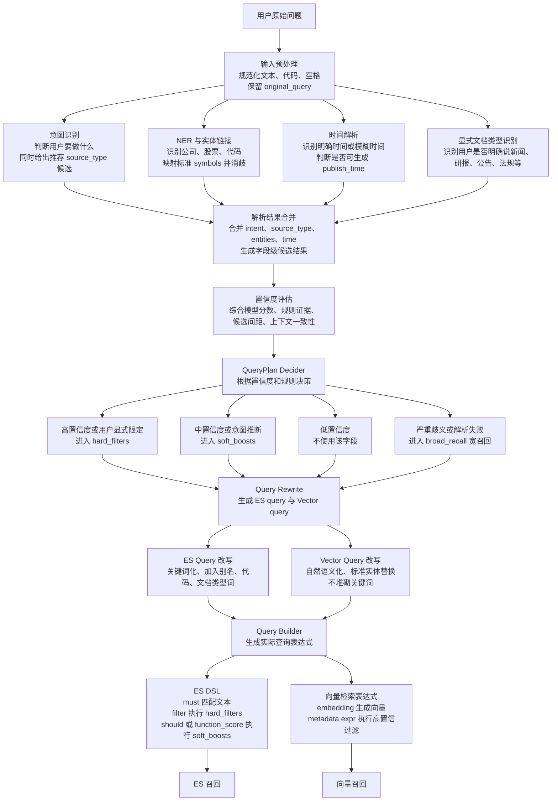

# 金融 RAG 查询理解与 Query Builder 流程设计

## 1. 设计结论

本流程不是 ReAct Agent，而是一个确定性的查询理解与查询构造流程。

核心思想：

```text
先解析用户问题
再评估字段置信度
再决定 hard_filter / soft_boost / ignore / broad_recall
最后分别构造 ES 查询和向量查询
```

对于低置信度或歧义问题，本系统不追问，统一采用宽召回策略。

---

## 2. 总体流程图



---

## 3. 步骤说明

### 3.1 输入预处理

作用：

- 规范化用户问题。
- 统一股票代码、空格、大小写。
- 保留原始问题，用于日志、rerank 和结果解释。

业内通常做法：

- 规则优先。
- 不改变用户问题语义。
- 保留 `original_query`、`normalized_query` 两份文本。

---

### 3.2 意图识别

作用：

- 判断用户要完成什么任务。
- 输出 `intent`。
- 同时输出推荐的 `source_type_candidates`。

示例：

```json
{
  "intent": "investment_analysis",
  "source_type_candidates": [
    { "source_type": 2, "name": "研报", "confidence": 0.78, "policy": "soft_boost" },
    { "source_type": 3, "name": "公告", "confidence": 0.70, "policy": "soft_boost" }
  ]
}
```

说明：

- 意图识别可以用于判断应该使用哪些文档类型。
- 但如果只是模型根据意图推断出的文档类型，通常进入 `soft_boosts`。
- 只有用户明确说“只看公告”“查研报”“法规里怎么说”时，才进入 `hard_filters.source_type`。

业内通常做法：

- 意图识别用于路由和 source_type 推荐。
- 显式文档类型限制才做 hard filter。
- 意图推断出的文档类型一般只做 soft boost，避免过早过滤。

---

### 3.3 NER / 实体链接 / 消歧

作用：

- 识别公司、股票、证券代码。
- 将文本 mention 映射为标准 `symbols`。
- 处理简称歧义。

示例：

```json
{
  "mention": "茅台",
  "name": "贵州茅台",
  "symbol": "600519.SH",
  "confidence": 0.94
}
```

处理策略：

| 情况 | 策略 |
|---|---|
| 明确代码或唯一公司名 | `hard_filters.symbols` |
| 简称歧义但有候选 | `soft_boosts.symbol_boost` |
| 低置信度实体 | 不使用 |
| 多候选接近 | broad_recall 宽召回 |

业内通常做法：

- 金融场景一般不只做 NER，而是做 Entity Linking。
- 先产生候选实体，再结合上下文、代码、别名、市场等信息排序。
- 候选第一名和第二名分差很小时，不做 hard filter。

---

### 3.4 时间解析

作用：

- 解析用户问题中的时间表达。
- 决定是否生成 `publish_time` 过滤。

处理策略：

| 时间表达 | 策略 |
|---|---|
| 2024 年、近 7 天、今年以来 | 可进入 `hard_filters.publish_time` |
| 最近、近期、最新 | 通常进入 `freshness_boost` |
| 前段时间、之前那个 | 不生成时间过滤 |
| 解析失败 | broad_recall 宽召回 |

业内通常做法：

- 规则解析优先。
- 明确时间才 hard filter。
- 模糊时间更多使用 freshness boost。
- 不同 source_type 可使用不同时间窗口。

---

### 3.5 显式文档类型识别

作用：

- 判断用户是否明确指定文档类型。
- 区分“显式限定”和“意图推断”。

示例：

| 用户问题 | 处理 |
|---|---|
| 查一下贵州茅台公告 | `source_type=3` 进入 hard filter |
| 看看贵州茅台最近怎么样 | 新闻、公告、舆情、研报进入 soft boost |
| 法规里怎么规定 | `source_type=5` 可进入 hard filter |

业内通常做法：

- 显式 source_type 是强信号。
- 意图推断 source_type 是弱信号。
- 综合分析类问题通常不限制 source_type，只做多源 boost。

---

### 3.6 解析结果合并

作用：

- 合并意图、实体、时间、文档类型识别结果。
- 形成统一的字段候选集合。
- 为后续置信度评估提供输入。

输出示例：

```json
{
  "intent": {},
  "entities": [],
  "time": {},
  "source_type_candidates": []
}
```

业内通常做法：

- 多模块并行解析。
- 最后统一合并和决策。
- 不让单个模块的错误提前限制召回范围。

---

### 3.7 置信度评估

作用：

- 给每个可过滤字段打分。
- 判断字段应该进入 hard filter、soft boost、ignore，还是触发宽召回。

置信度来源：

| 来源 | 说明 |
|---|---|
| 模型分数 | intent 分类概率、NER 分数、entity linking 分数 |
| 规则证据 | 是否出现股票代码、是否出现“公告/研报”等显式词 |
| 候选间距 | 第一候选与第二候选分差是否足够大 |
| 上下文一致性 | 意图、实体、source_type、时间是否互相支持 |
| 召回风险 | hard filter 后是否可能过窄 |
| 历史校准 | 基于标注集或线上日志调整阈值 |

建议阈值：

| 字段 | hard filter 阈值建议 |
|---|---:|
| `symbols` | 0.85 - 0.90 |
| `source_type` | 0.75 - 0.85 |
| `publish_time` | 0.80 - 0.90 |
| `permission_scope` | 系统注入，不走置信度 |

业内通常做法：

- 不直接相信模型原始概率。
- 会用标注集、线上日志做阈值调优。
- 对分类概率可做概率校准。
- 对实体链接通常看候选排序分数和候选间距。

---

### 3.8 QueryPlan Decider

作用：

- 根据置信度和业务规则生成最终 QueryPlan。
- 决定每个字段的使用方式。

决策规则：

```text
高置信度 + 用户显式表达 -> hard_filters
中置信度或模型推断 -> soft_boosts
低置信度 -> ignore
严重歧义或解析失败 -> broad_recall
```

推荐 hard filter 字段：

```json
{
  "symbols": ["600519.SH"],
  "source_type": [3],
  "publish_time": {
    "from": "2025-01-01",
    "to": "2025-12-31"
  },
  "permission_scope": ["public", "licensed"],
  "doc_status": "published",
  "is_deleted": false
}
```

业内通常做法：

- 权限类字段永远 hard filter。
- 业务字段由置信度和显式性决定。
- 低置信度不强行过滤，宁可宽召回。

---

### 3.9 Broad Recall 宽召回

作用：

- 当实体、时间或 source_type 不确定时，避免错误 hard filter。
- 用更宽的召回范围保证召回率。

常见触发条件：

- 实体歧义，例如“平安”。
- 时间模糊，例如“之前那个”“最近”。
- 文档类型不明确。
- 解析结果置信度低。
- hard filter 组合后预计结果过少。

处理方式：

```json
{
  "hard_filters": {
    "permission_scope": ["public", "licensed"],
    "doc_status": "published",
    "is_deleted": false
  },
  "soft_boosts": {
    "source_type_boost": {},
    "freshness_boost": {},
    "symbol_boost": {}
  },
  "retrieval_mode": "broad_recall"
}
```

业内通常做法：

- 非 Agent 流程中一般不频繁追问。
- 对模糊问题先宽召回，再通过融合、rerank、答案组织降低噪声。
- 永远不放宽权限过滤。

---

### 3.10 Query Rewrite

作用：

- 生成适合 ES 和向量检索的两类 query。
- 不改变原始语义，只做标准化和轻量扩展。

#### ES Query

特点：

- 更关键词化。
- 可加入公司标准名、股票代码、简称、文档类型词、事件词。

示例：

```text
贵州茅台 600519.SH 茅台 公告 重要事项 最新
```

#### Vector Query

特点：

- 更自然语言化。
- 替换标准实体名。
- 不堆砌关键词。

示例：

```text
贵州茅台近期公告中的重要事项
```

业内通常做法：

- ES query 偏关键词和召回。
- Vector query 偏语义表达。
- 原始问题保留给 rerank 使用。

---

### 3.11 Query Builder

作用：

- 将 QueryPlan 转换为 ES DSL 和向量检索表达式。

#### ES DSL

使用：

- `must`：关键词匹配。
- `filter`：执行 hard_filters。
- `should` 或 `function_score`：执行 soft_boosts。

示例：

```json
{
  "query": {
    "bool": {
      "must": [
        { "match": { "content": "贵州茅台 公告 重要事项" } }
      ],
      "filter": [
        { "terms": { "symbols": ["600519.SH"] } },
        { "terms": { "source_type": [3] } },
        { "terms": { "permission_scope": ["public", "licensed"] } },
        { "term": { "doc_status": "published" } },
        { "term": { "is_deleted": false } }
      ],
      "should": [
        { "range": { "publish_time": { "gte": "now-180d/d" } } }
      ]
    }
  }
}
```

#### 向量检索表达式

使用：

- `vector_query` 生成 embedding。
- 高置信 metadata 进入向量过滤表达式。
- soft boosts 通常在召回后融合阶段处理。

示例：

```json
{
  "vector_query": "贵州茅台近期公告中的重要事项",
  "expr": "source_type in [3] and symbols in ['600519.SH'] and is_deleted == false",
  "top_k": 50
}
```

业内通常做法：

- ES 承担关键词、结构化过滤和部分 boost。
- 向量库承担语义召回和高置信 metadata 过滤。
- soft boost 可在 ES 内执行，也可在融合阶段统一处理。

---

## 4. 示例 QueryPlan

### 4.1 明确问题

用户问题：

```text
茅台最近公告有啥重要的？
```

QueryPlan：

```json
{
  "original_query": "茅台最近公告有啥重要的？",
  "intent": {
    "name": "company_announcement_summary",
    "confidence": 0.91
  },
  "hard_filters": {
    "symbols": ["600519.SH"],
    "source_type": [3],
    "permission_scope": ["public", "licensed"],
    "doc_status": "published",
    "is_deleted": false
  },
  "soft_boosts": {
    "freshness_boost": {
      "field": "publish_time",
      "half_life_days": 60,
      "weight": 0.2
    }
  },
  "rewrite": {
    "es_query": "贵州茅台 600519.SH 茅台 公告 重要事项 最新",
    "vector_query": "贵州茅台近期公告中的重要事项",
    "rerank_query": "茅台最近公告有啥重要的？"
  },
  "retrieval_mode": "normal"
}
```

---

### 4.2 歧义问题

用户问题：

```text
平安最近咋样？
```

QueryPlan：

```json
{
  "original_query": "平安最近咋样？",
  "intent": {
    "name": "company_recent_update",
    "confidence": 0.72
  },
  "hard_filters": {
    "permission_scope": ["public", "licensed"],
    "doc_status": "published",
    "is_deleted": false
  },
  "soft_boosts": {
    "symbol_boost": {
      "601318.SH": 1.15,
      "000001.SZ": 1.12
    },
    "source_type_boost": {
      "1": 1.25,
      "3": 1.15,
      "12": 1.15,
      "2": 1.05
    },
    "freshness_boost": {
      "field": "publish_time",
      "half_life_days": 30,
      "weight": 0.2
    }
  },
  "rewrite": {
    "es_query": "平安 中国平安 平安银行 最近 新闻 公告 舆情",
    "vector_query": "平安相关公司近期的重要动态",
    "rerank_query": "平安最近咋样？"
  },
  "retrieval_mode": "broad_recall"
}
```

---

## 5. 关键原则

1. 意图识别可以用于判断推荐文档类型，但通常只生成 `source_type_boost`。
2. 用户明确指定文档类型时，`source_type` 才进入 hard filter。
3. 权限类字段永远 hard filter，且不可放宽。
4. 股票代码或唯一实体高置信时，`symbols` 才进入 hard filter。
5. 模糊实体不要 hard filter，使用 symbol boost 或宽召回。
6. 明确时间才进入 `publish_time` hard filter。
7. “最近 / 最新 / 近期”通常使用 freshness boost。
8. 非 Agent 流程下不追问，歧义问题采用 broad recall。
9. ES query 可以关键词化，Vector query 要保持自然语义。
10. Query Builder 之后可以做召回不足降级，但不能放宽权限过滤。

---

## 6. 简要总结

本方案可以概括为：

```text
Confidence-aware Query Planning for Hybrid RAG
```

在你们的金融 RAG 中，推荐主路径是：

```text
输入预处理
-> 意图识别 / NER / 时间解析 / 文档类型识别
-> 解析结果合并
-> 置信度评估
-> QueryPlan 决策
-> ES Query 和 Vector Query 改写
-> Query Builder
-> ES 召回和向量召回
```
