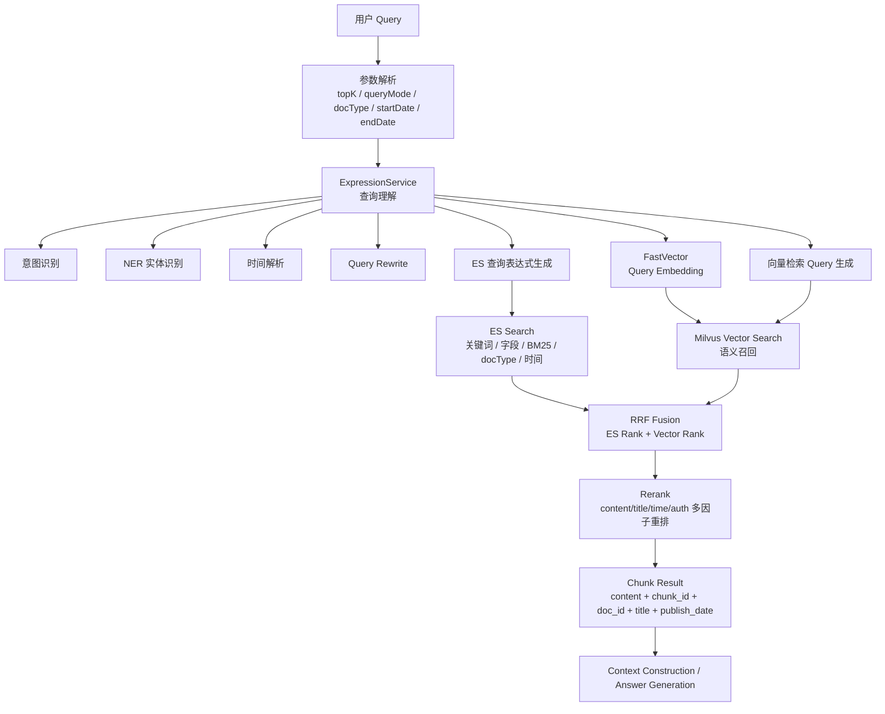
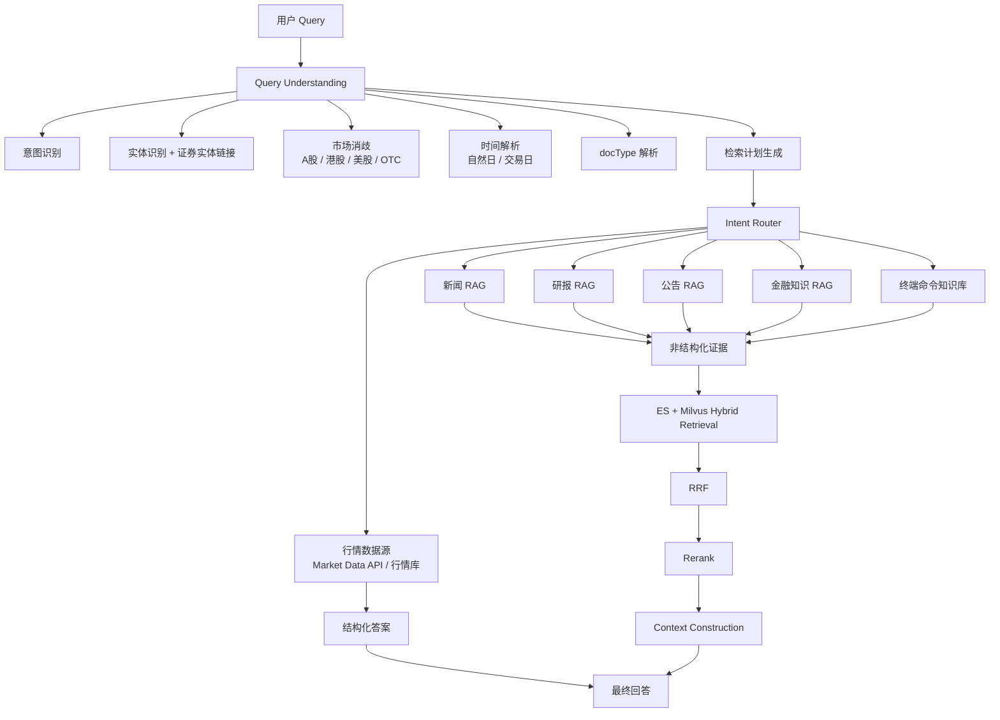

# 金融信息领域 RAG 架构分析文档（反推修正版）

> 版本：v1.0  
> 适用场景：金融资讯、新闻、研报、公告、金融知识、终端命令等混合知识库 RAG  
> 依据：两次真实 query 输出、debug 耗时、`rrfDebug`、`debug_msg`、`rewritedQuery`、queryMode 与 docType 入参，以及查询理解层已有说明。

---

## 0. 一句话结论

当前系统更像是一个 **查询理解驱动的 chunk 级混合检索 RAG 架构**，而不是严格的“文档级召回 → 候选 doc_id → 文档内 chunk 检索”的 doc-first 两阶段架构。

更准确的主链路应理解为：

```text
用户 Query
  ↓
查询理解 / ExpressionService
  ↓
Query Embedding / FastVector
  ↓
双路 chunk 级召回
  ├─ ES 关键词 / 字段 / BM25 召回
  └─ Milvus 向量语义召回
  ↓
RRF 融合
  ↓
多因子 Rerank
  ↓
返回 Chunk + 文档元数据
```

其中，文档字段如 `doc_id`、`doc_type`、`title`、`publish_date`、`publisher_authority` 更像是 **chunk 的元数据、过滤字段、排序特征、权限字段和展示字段**，而不是严格意义上的前置文档候选集。

---

## 1. 当前架构反推依据

### 1.1 从耗时看，主链路不是文档级召回后再 chunk 检索

两次 query 的核心耗时如下：

| Query | Total_cost | ExpressionService_cost | FastVector_cost | EsSearch_cost | EsSearchMilvus_cost | Rerank_cost | ChunkSearch_cost |
|---|---:|---:|---:|---:|---:|---:|---:|
| 宁德时代昨天行情怎么样 | 3786ms | 2288ms | 533ms | 299ms | 243ms | 153ms | 32ms |
| 腾讯控股昨日收盘价 | 3198ms | 1700ms | 283ms | 211ms | 223ms | 667ms | 64ms |

如果系统是严格的：

```text
文档级召回 → 候选 doc_id → 文档内 chunk 检索
```

那么 `ChunkSearch_cost` 应该是核心耗时之一。但当前 `ChunkSearch_cost` 只有几十毫秒，而真正重的是：

```text
ExpressionService
FastVector
EsSearch
EsSearchMilvus
Rerank
```

所以最大可能的解释是：

> `ChunkSearch_cost` 不是主检索阶段，而更像是 chunk 结果包装、chunk 内容补全、元数据读取、queryMode 处理或轻量后处理。

---

### 1.2 从 `rrfDebug` 看，RRF 是在 chunk 维度上做的

返回结果中每条结果都有：

```json
"chunk_id": ...,
"content": "...",
"doc_id": "...",
"rrfDebug": {
  "hitEs": true,
  "hitVec": true,
  "rankEs": 22,
  "rankVec": 5,
  "rankFinal": 5,
  "rrfEs": 0.012195121951219513,
  "rrfVec": 0.015384615384615385,
  "rrfTotal": 0.027579737335834898
}
```

这说明每条最终返回对象本身就是一个 chunk，并且这个 chunk 记录了自己在 ES 路径、向量路径、RRF 融合路径中的排名。

因此更合理的判断是：

```text
ES 召回 chunk 列表
Milvus 召回 chunk 列表
  ↓
按 chunk 维度做 RRF
```

而不是：

```text
先 RRF 文档
再查文档内 chunk
```

---

### 1.3 从 `rankFinal` 和最终 `score` 看，RRF 不是最终排序

在腾讯控股 query 中，有一条研报结果 `rankFinal = 1`，说明它在 RRF 阶段排名非常靠前，但最终并没有排在第一；相反，最终排序主要由 `score` 决定。

这说明当前链路是：

```text
ES / Vector 召回
  ↓
RRF 融合候选
  ↓
Rerank 重新打分
  ↓
按 rerank score 返回
```

所以 RRF 是中间融合层，不是最终排序层。

---

## 2. 当前系统的推荐架构图

### 2.1 当前最大可能架构



---

### 2.2 面向金融信息领域的目标架构

当前架构已经具备完整 RAG 检索链路，但金融领域还需要引入 **结构化数据路由**。尤其是“昨日收盘价”“涨跌幅”“成交量”“资金流向”等 query，不应该完全依赖新闻 chunk 抽取。

推荐目标架构如下：



目标原则是：

```text
数值类事实 → 结构化数据源优先
解释类内容 → RAG 文档检索补充
```

例如：

```text
腾讯控股昨日收盘价
```

应优先路由到：

```text
证券实体链接：腾讯控股 → 00700.HK
交易日解析：昨日 → 港股上一个交易日
行情数据源：close / pct_change / volume / turnover
```

RAG 只负责补充：

```text
为什么跌
市场观望什么
相关新闻是什么
研报怎么看
公告有什么影响
```

---

## 3. 入参层：Query、topK、queryMode、docType、时间范围

### 3.1 当前入参形式

示例：

```json
{
  "query": "腾讯控股昨日收盘价",
  "topK": 15,
  "queryMode": "文件+Chunk",
  "docType": "新闻,研报,公告,金融知识,终端命令",
  "startDate": null,
  "endDate": null
}
```

docType 映射关系：

| docType 名称 | 编码 |
|---|---:|
| 新闻 | 1 |
| 研报 | 2 |
| 公告 | 3 |
| 3C | 4 |
| 法律法规 | 5 |
| 金融知识 | 6 |
| 终端命令 | 7 |
| 万得大学 | 8 |
| 舆情 | 12 |
| 帮助中心 | 17 |

---

### 3.2 当前最大可能做法

入参层主要做参数标准化：

1. 解析用户原始 query。
2. 读取 topK，决定最终返回数量。
3. 解析 queryMode，决定返回文档级结果还是 chunk 级结果。
4. 解析 docType，将中文类型转换成内部编码。
5. 解析 startDate / endDate，如果用户显式传入，则作为检索过滤条件。
6. 如果 startDate / endDate 未传入，则交给查询理解层解析 query 中的时间表达。

---

### 3.3 queryMode 当前行为推断

#### 1. 文件模式

最大可能行为：

```text
返回文档级搜索结果
```

适合：

- 找某份文件；
- 找某篇研报；
- 找某条公告；
- 返回类似搜索引擎结果列表。

可能返回字段：

```text
doc_id
title
doc_type
publish_date
source
summary
score
```

---

#### 2. 文件 + Chunk 模式

这是当前 RAG 主模式。

最大可能行为：

```text
以 chunk 为最终排序和返回单位，同时携带文档元数据。
```

当前输出中结果包含：

```text
chunk_id
chunk_raw_id
chunk_type
content
headings
doc_id
doc_type
title
publish_date
publisher_authority
rrfDebug
debug_msg
score
```

所以“文件+Chunk”不应理解成“先返回文件，再返回 chunk”，更合理的理解是：

```text
chunk 结果 + 文件元数据
```

这个模式最适合：

- RAG 问答；
- 需要证据片段；
- 需要引用；
- 需要提供给 LLM 的上下文构建。

---

#### 3. Chunk-only 模式

之前观察到 chunk-only 为空，但结合最新输出，不能再断言 chunk 检索一定依赖 doc_id 候选集。

更合理的解释有三种：

1. 产品层未开放 chunk-only 入口；
2. chunk-only 模式参数组合不完整；
3. chunk-only 模式没有配置默认 docType、权限或过滤条件；
4. 当前主链路已经能生成 chunk 级结果，但该 queryMode 的分支没有打通。

建议后续专门验证：

```text
同一 query + 同一 docType + queryMode=Chunk
```

并观察：

```text
ES 是否执行
Milvus 是否执行
RRF 是否执行
ChunkSearch_cost 是否变化
```

---

### 3.4 入参层优化方案

1. **docType 不仅要作为过滤条件，还要参与意图权重。**

   例如：

   | Query 意图 | 推荐 docType 优先级 |
   |---|---|
   | 行情查询 | 行情数据源 > 新闻 |
   | 下跌原因 | 新闻 > 研报 > 公告 |
   | 业绩点评 | 研报 > 新闻 > 公告 |
   | 分红方案 | 公告 > 新闻 |
   | 概念解释 | 金融知识 > 帮助中心 |
   | 终端怎么查 | 终端命令 > 帮助中心 |

2. **startDate/endDate 应和时间解析结果合并。**

   如果用户入参传了时间范围，应作为 hard filter；如果只是在 query 中说“最近”，可以作为 soft boost 或动态时间窗。

3. **增加 market 参数。**

   金融场景中建议支持：

   ```text
   market = CN / HK / US / OTC / GLOBAL
   ```

   如果用户不传，则由实体链接和默认市场规则推断。

4. **增加 securityCode 参数。**

   如果前端或上游已经知道证券代码，应直接传入，避免召回阶段实体歧义。

---

## 4. 查询理解层 / ExpressionService

### 4.1 模块定位

查询理解层主要负责把用户自然语言 query 转换成适合后续检索的结构化或半结构化查询表达。

它不是单纯做问句改写，而是完整的 Query Understanding 流程，包括：

```text
意图识别
实体识别
实体链接
市场消歧
时间解析
Query Rewrite
检索表达式生成
```

它的目标不是让句子更通顺，而是提升：

```text
召回率
topK 命中率
实体匹配准确率
时间匹配准确率
最终答案准确率
```

---

### 4.2 当前输出中的证据

宁德时代 query：

```text
原始 query：
宁德时代昨天行情怎么样

rewritedQuery：
查询宁德时代在2026年5月12日的股票交易表现，包括收盘价、涨跌幅、成交量及成交额等关键行情数据。
```

腾讯控股 query：

```text
原始 query：
腾讯控股昨日收盘价

rewritedQuery：
腾讯控股在2026年5月12日的股票收盘价数据及行情表现。
```

这说明系统至少完成了：

1. 时间解析：`昨天 / 昨日` → `2026年5月12日`
2. 语义补全：`行情怎么样` → `收盘价、涨跌幅、成交量、成交额`
3. 实体识别：`宁德时代`、`腾讯控股`
4. 检索意图增强：把短 query 改写成检索友好的描述

debug 中还有：

```json
"esExprResult": {
  "intentResponse": {
    "apiTime": null
  },
  "nerEntity": {
    "cost_time": 0.0898
  },
  "pmp_cost": 1077,
  "timeModelResponse": {
    "apiTime": "487ms"
  }
}
```

最大可能解释：

- `nerEntity` 是实体识别模块；
- `timeModelResponse` 是时间解析模型或服务；
- `pmp_cost` 很可能是 Query Rewrite、prompt/model planning 或检索表达式生成相关耗时；
- `ExpressionService_cost` 是查询理解总耗时。

---

### 4.3 具体做法：意图识别

意图识别负责判断用户到底想查什么。

金融 RAG 里常见意图包括：

| 意图 | 示例 query | 主要处理方式 |
|---|---|---|
| 行情查询 | 腾讯控股昨日收盘价 | 结构化行情数据源优先 |
| 行情解释 | 宁德时代昨天为什么跌 | 行情数据 + 新闻 RAG |
| 资金流查询 | 宁德时代资金流向 | 资金流数据 + 新闻 RAG |
| 研报观点 | 券商怎么看腾讯一季报 | 研报 RAG |
| 公告查询 | 宁德时代最近公告 | 公告库 hard filter |
| 财务查询 | 腾讯一季度收入 | 财报 / 公告 / 财务库 |
| 新闻事件 | 腾讯收购喜马拉雅进展 | 新闻 + 公告 |
| 金融知识 | 什么是融资融券 | 金融知识库 |
| 终端命令 | Wind 怎么查港股行情 | 终端命令知识库 |

当前系统中 `intentResponse.apiTime = null`，说明意图识别可能没有走独立 API，也可能被合并到了 PMP / ExpressionService 中。

#### 推荐实现

线上高并发场景建议使用：

```text
规则 + 小模型分类 + LLM 兜底
```

具体做法：

1. 高频意图用规则识别：

   ```text
   收盘价 / 涨跌幅 / 成交额 / 成交量 → 行情查询
   为什么跌 / 原因 / 影响 → 行情解释
   公告 / 分红 / 回购 / 减持 → 公告查询
   研报 / 目标价 / 评级 / 券商怎么看 → 研报观点
   怎么查 / 终端命令 / 函数 → 终端命令
   ```

2. 常规 query 用小模型多标签分类。

3. 复杂 query 用 LLM 做兜底。

4. 支持多意图，例如：

   ```text
   宁德时代昨天为什么跌，有没有公告影响？
   ```

   可识别为：

   ```text
   行情解释 + 公告查询
   ```

---

### 4.4 具体做法：实体识别

实体识别负责抽取 query 中的公司、证券、行业、指标、文档类型、事件等。

金融领域实体示例：

| 实体类型 | 示例 |
|---|---|
| 公司 | 腾讯控股、宁德时代、贵州茅台 |
| 证券代码 | 00700.HK、300750.SZ、600519.SH |
| 行业 | 新能源车、互联网、半导体 |
| 指标 | 收盘价、成交额、涨跌幅、融资余额 |
| 文档类型 | 研报、公告、新闻 |
| 事件 | 收购、回购、分红、业绩披露 |
| 时间 | 昨日、最近三个月、今年 Q1 |

#### 推荐实现

不要完全依赖大模型。更稳定的组合是：

```text
词典 / 规则 / AC 自动机 / Trie
  +
轻量 NER 模型
  +
LLM 兜底
```

具体做法：

1. 高频确定实体用词典和规则：
   - 公司名；
   - 证券代码；
   - 指标名；
   - docType；
   - 行业；
   - 市场后缀。

2. 长尾表达用小模型 NER：
   - BERT-CRF；
   - RoBERTa-CRF；
   - 蒸馏模型；
   - 金融领域微调模型。

3. 复杂 query 用 LLM 辅助：
   - 识别隐式实体；
   - 识别别名；
   - 识别跨市场表达。

---

### 4.5 具体做法：实体链接和标准化

实体识别之后必须做实体链接。

例如：

```text
腾讯
腾讯控股
Tencent
Tencent Holdings
00700
0700.HK
```

都应该链接到：

```json
{
  "entity_name": "腾讯控股",
  "security_code": "00700.HK",
  "market": "HK",
  "currency": "HKD"
}
```

宁德时代则可能有：

```json
{
  "entity_name": "宁德时代",
  "primary_security": "300750.SZ",
  "secondary_security": "3750.HK",
  "market": "CN/HK",
  "currency": "CNY/HKD"
}
```

#### 为什么这一步重要

腾讯 query 中，系统 top1 命中了：

```text
腾讯控股-OTC，收盘价 58.35 美元
```

但中文语境下，用户问“腾讯控股昨日收盘价”，更大概率期待的是：

```text
腾讯控股 00700.HK 的港股收盘价
```

所以仅仅识别“腾讯控股”不够，还要识别：

```text
用户问的是哪个市场的腾讯控股？
```

#### 推荐实现

维护一张金融实体主数据表：

```json
{
  "entity_id": "company_tencent",
  "canonical_name": "腾讯控股",
  "aliases": ["腾讯", "Tencent", "Tencent Holdings", "腾讯控股有限公司"],
  "securities": [
    {
      "code": "00700.HK",
      "market": "HK",
      "currency": "HKD",
      "is_primary": true
    },
    {
      "code": "TCEHY",
      "market": "US_OTC",
      "currency": "USD",
      "is_primary": false
    }
  ]
}
```

默认规则：

```text
中文公司名 + 无市场限定 → 优先主上市地
港股公司名 → 优先 HK
A股简称 → 优先 CN
出现 OTC / ADR / 美股 → 切到 US/OTC
出现港股 / H股 / 00700 → 切到 HK
```

---

### 4.6 具体做法：时间解析

时间解析负责把自然语言时间转换成明确日期或时间范围。

常见表达：

```text
今天
昨天
昨日
上周
近三个月
今年 Q1
财报后
春节前后
三季报披露以来
```

#### 当前系统表现

当前系统能把：

```text
昨天 / 昨日 → 2026年5月12日
```

说明基础时间解析已经生效。

#### 金融场景的特殊要求

金融场景不能只解析自然日，还要区分：

| 时间类型 | 含义 | 示例 |
|---|---|---|
| calendar_date | 自然日 | 2026-05-12 |
| trade_date | 交易日 | 港股 2026-05-12 |
| publish_date | 文档发布时间 | 新闻发布时间 |
| event_date | 事件发生日期 | 公告生效日、收购获批日 |
| report_period | 财报期 | 2026Q1 |
| disclosure_date | 披露日期 | 一季报发布时间 |

对于：

```text
腾讯控股昨日收盘价
```

真正需要的是：

```text
trade_date = 2026-05-12
market = HK
```

而不是：

```text
publish_date 接近 2026-05-12
```

#### 推荐实现

1. 确定性时间表达用规则：
   - 今天；
   - 昨天；
   - 上周；
   - 近 30 天；
   - 今年 Q1。

2. 模糊时间表达用模型：
   - 最近；
   - 财报后；
   - 春节前后；
   - 三季报披露以来。

3. 接入交易日历：
   - A 股交易日历；
   - 港股交易日历；
   - 美股交易日历；
   - 节假日；
   - 半日市；
   - 时区。

4. 按 intent 决定时间含义：
   - 行情 query：trade_date；
   - 新闻 query：publish_date / event_date；
   - 财报 query：report_period / disclosure_date；
   - 公告 query：announcement_date / effective_date。

---

### 4.7 具体做法：Query Rewrite

Query Rewrite 负责把短 query、口语 query 改写成更适合检索的表达。

例如：

```text
宁德时代昨天行情怎么样
```

改写为：

```text
查询宁德时代在2026年5月12日的股票交易表现，包括收盘价、涨跌幅、成交量及成交额等关键行情数据。
```

这个改写对 ES 和向量检索都有帮助：

- ES 可以命中“收盘价、涨跌幅、成交量、成交额”；
- 向量检索可以更好理解“行情怎么样”的语义；
- rerank 可以利用更明确的 query 表达计算 content_score。

#### 推荐做法

1. 保留原始 query。
2. 生成一个主 rewrite。
3. 根据需要生成多个子 query：

   ```text
   腾讯控股 2026年5月12日 收盘价
   腾讯控股 00700.HK 5月12日 收跌 涨跌幅
   腾讯控股 昨日 成交额 成交量
   ```

4. 根据 intent 控制改写范围，避免 query drift。

#### 风险

Query Rewrite 最大风险是改写偏离原意。例如：

```text
腾讯控股昨日收盘价
```

不能被改写成过宽的：

```text
腾讯控股股票行情表现
```

否则会召回：

- ETF；
- 行业周报；
- 腾讯音乐；
- 腾讯收购喜马拉雅；
- OTC 新闻。

所以建议：

```text
精确数值 query → rewrite 要收窄
原因解释 query → rewrite 可以扩展
```

---

### 4.8 具体做法：检索表达式生成

ExpressionService 最后应输出一个结构化检索计划，而不是只有 `rewritedQuery`。

推荐输出：

```json
{
  "intent": "market_quote",
  "entities": [
    {
      "raw": "腾讯控股",
      "canonical_name": "腾讯控股",
      "security_code": "00700.HK",
      "market": "HK",
      "confidence": 0.93
    }
  ],
  "time": {
    "raw": "昨日",
    "calendar_date": "2026-05-12",
    "trade_date": "2026-05-12",
    "calendar": "HK"
  },
  "doc_types": ["news", "research", "announcement", "financial_knowledge", "terminal_command"],
  "hard_filters": {
    "security_code": "00700.HK",
    "trade_date": "2026-05-12"
  },
  "soft_boosts": {
    "publish_date": "recent",
    "title_terms": ["收盘价", "股价", "行情"],
    "authority": "high"
  },
  "rewrite_query": "腾讯控股在2026年5月12日的港股收盘价及行情表现。"
}
```

这样 ES、Milvus、RRF、Rerank 都能使用同一套 query plan。

---

### 4.9 查询理解层优化方案

1. **增加独立 intent router。**
   - 行情 query 不应完全走 RAG；
   - 研报 query 应提高研报权重；
   - 公告 query 应 hard filter 公告；
   - 金融知识 query 应优先知识库。

2. **实体链接前置。**
   - 先确定“腾讯控股 = 00700.HK”，再 rewrite；
   - 避免 rewrite 后把 OTC、ETF、行业周报混进来。

3. **市场消歧。**
   - 港股、A 股、美股、OTC 要明确；
   - 默认市场规则要可解释。

4. **交易日历接入。**
   - “昨日收盘价”要映射到上一个交易日；
   - 周末、节假日要正确回退。

5. **降低 ExpressionService 延迟。**
   - 高频实体缓存；
   - 高频时间表达缓存；
   - 高频 query rewrite 缓存；
   - 简单 query 使用规则模板；
   - 复杂 query 再调用 LLM；
   - NER、时间解析、意图识别并行化。

---

## 5. FastVector / Query Embedding 层

### 5.1 模块定位

FastVector 负责把 query 转换成 embedding，用于 Milvus 向量检索。

它解决的是：

```text
语义召回
同义表达
口语 query
模糊问题
长尾表达
```

例如：

```text
行情怎么样
```

可以匹配到：

```text
股票交易表现
收盘价
涨跌幅
成交额
资金流向
市场表现
```

---

### 5.2 当前输出中的证据

两次 query 的 FastVector 耗时：

```text
宁德时代：533ms
腾讯控股：283ms
```

说明 query embedding 是在线生成的，而且成本不低。

---

### 5.3 具体做法

最大可能链路：

```text
rewritedQuery / 原始 query
  ↓
Embedding 模型
  ↓
Query Vector
  ↓
Milvus ANN Search
```

其中 query embedding 可能使用：

1. 原始 query；
2. rewritedQuery；
3. 原始 query + rewrite 拼接；
4. 根据 intent 生成的检索 query。

推荐做法：

```text
精确查询：原始 query + 实体字段为主
语义查询：rewritedQuery 为主
多意图查询：多个 query embedding
```

---

### 5.4 金融场景优化方案

1. **Embedding 缓存。**
   - 高频 query 如“腾讯控股收盘价”可以缓存；
   - 同一天内“昨日”解析稳定时可以缓存 rewrite + embedding。

2. **金融领域 embedding 微调。**
   - 通用 embedding 对金融指标、公告、研报术语不一定敏感；
   - 可用点击数据、标注数据、query-doc 对进行微调。

3. **区分短 query 和长 query。**
   - 短 query 更依赖实体和字段；
   - 长 query 更适合向量语义召回。

4. **支持多向量检索。**
   - title vector；
   - content vector；
   - summary vector；
   - table vector；
   - entity-enhanced vector。

5. **行情类 query 降低向量优先级。**
   - “昨日收盘价”这种 query 应结构化数据优先；
   - 向量检索只作为解释补充，不应决定主答案。

---

## 6. ES 关键词 / 字段召回层

### 6.1 模块定位

ES 负责关键词、字段和结构化条件检索，主要解决金融场景中的精确匹配问题。

它适合处理：

```text
公司名
证券代码
日期
标题
指标名
文档类型
公告编号
数字
专有名词
```

---

### 6.2 当前输出中的证据

返回结果中有：

```json
"score_bm25": 323.1707458496094
```

以及：

```json
"rrfDebug": {
  "hitEs": true,
  "rankEs": 22,
  "rrfEs": 0.012195121951219513
}
```

说明 ES 路径参与了 chunk 召回，并给出了 BM25 或类似 lexical score。

---

### 6.3 具体做法

最大可能 ES 查询结构：

```json
{
  "bool": {
    "filter": [
      { "terms": { "doc_type": ["1", "2", "3", "6", "7"] } },
      { "range": { "publish_date": { "gte": "...", "lte": "..." } } }
    ],
    "should": [
      { "match": { "title": { "query": "腾讯控股昨日收盘价", "boost": 3 } } },
      { "match": { "content": { "query": "腾讯控股在2026年5月12日的股票收盘价数据及行情表现", "boost": 1 } } },
      { "term": { "security_name": { "value": "腾讯控股", "boost": 5 } } },
      { "term": { "security_code": { "value": "00700.HK", "boost": 8 } } }
    ],
    "minimum_should_match": 1
  }
}
```

字段推荐：

| 字段 | 用途 |
|---|---|
| title | 标题匹配 |
| content | 正文匹配 |
| headings | 章节标题匹配 |
| doc_type | 文档类型过滤 |
| publish_date | 发布时间 |
| event_date | 事件日期 |
| trade_date | 交易日期 |
| security_name | 证券简称 |
| security_code | 证券代码 |
| market | 市场 |
| source | 来源 |
| authority | 权威性 |
| is_ai_generated | 是否 AI 生成 |
| permission | 权限控制 |

---

### 6.4 金融场景优化方案

1. **增加 security_code hard filter。**

   例如 query 已链接到 `00700.HK`，则优先检索：

   ```text
   security_code = 00700.HK
   ```

2. **增加 market hard filter 或 strong boost。**

   对“腾讯控股”默认港股：

   ```text
   market = HK
   ```

   OTC 结果应降权，除非用户显式说 OTC / 美股。

3. **增加 trade_date 字段。**

   对“昨日收盘价”：

   ```text
   trade_date = 2026-05-12
   ```

   不应只依赖 publish_date。

4. **title boost 要按 intent 调整。**

   收盘价 query 应提高：

   ```text
   收盘价 / 股价 / 报 / 收跌 / 收涨 / 涨跌幅
   ```

5. **AI 生成新闻降权。**

   对包含：

   ```text
   本文由人工智能（AI）生成
   ```

   的内容可适当降低 source_quality 或 auth_score。

6. **数值字段结构化抽取。**

   从新闻和表格中抽取：

   ```text
   close
   pct_change
   volume
   turnover
   currency
   unit
   trade_date
   ```

   存入结构化字段，减少对原文文本匹配的依赖。

---

## 7. Milvus 向量召回层

### 7.1 模块定位

Milvus 向量召回负责语义匹配，弥补 ES 对同义、口语、模糊表达的不足。

适合召回：

```text
用户没有说出明确关键词但语义相关的内容
研报中的观点段落
新闻中的原因解释
金融知识解释
复杂问句相关段落
```

---

### 7.2 当前输出中的证据

返回结果中有：

```json
"score_vector": 0.7135224938392639,
"rrfDebug": {
  "hitVec": true,
  "rankVec": 5,
  "rrfVec": 0.015384615384615385
}
```

说明向量路径参与了召回。

需要注意：

> `score_vector` 不一定等于“是否被 Milvus 召回”的判断依据。

判断是否命中向量路径，应看：

```text
hitVec
rankVec
rrfVec
```

因为有些结果虽然 `hitVec=false`，但仍然有 `score_vector`，说明 `score_vector` 可能是后处理阶段补算的语义相似度，或者是另一个语义分字段。

---

### 7.3 具体做法

最大可能链路：

```text
Query Embedding
  ↓
Milvus ANN Search
  ↓
返回 topN chunk_id
  ↓
根据 chunk_id 回表补充 content / title / doc metadata
  ↓
与 ES 结果进入 RRF
```

Milvus collection 可能包含：

```text
chunk_id
doc_id
embedding
doc_type
publish_date
source_type
security_code
market
permission
```

---

### 7.4 金融场景优化方案

1. **向量召回前加入 metadata filter。**

   例如：

   ```text
   doc_type in [新闻, 研报, 公告]
   market = HK
   security_code = 00700.HK
   ```

2. **向量召回后进行实体校验。**

   如果向量召回到“腾讯音乐”“腾讯相关 ETF”，但 query 实体是“腾讯控股”，应降权或过滤。

3. **分 docType 建立向量索引或 partition。**

   例如：

   ```text
   news_vector
   research_vector
   announcement_vector
   knowledge_vector
   command_vector
   ```

   或使用 partition key。

4. **表格向量单独处理。**

   研报和行情新闻中大量答案在表格里。建议为表格生成单独 embedding：

   ```text
   table_caption + row_header + column_header + cell_text
   ```

5. **多向量表示。**

   一条 chunk 可有多个向量：

   ```text
   content_embedding
   title_embedding
   entity_embedding
   summary_embedding
   table_embedding
   ```

6. **向量召回权重按 intent 调整。**

   - 行情数值：向量低权重；
   - 原因解释：向量高权重；
   - 研报观点：向量高权重；
   - 公告精确查询：ES 高权重。

---

## 8. RRF 融合层

### 8.1 模块定位

RRF，即 Reciprocal Rank Fusion，用于融合 ES 与向量检索结果。

它解决的问题是：

```text
ES 的 BM25 分数和向量相似度分数不可直接比较。
```

所以 RRF 不直接相加原始分数，而是根据排名融合。

---

### 8.2 当前系统中的 RRF 公式

从 debug 数值可以反推，当前 RRF 的 rank constant 大概率是 60。

公式：

```text
RRF(d) = Σ 1 / (k + rank_i(d))
```

其中：

```text
k ≈ 60
```

例如 rank=1：

```text
1 / (60 + 1) = 0.0163934426
```

宁德 query 中某结果：

```json
"rankEs": 1,
"rankVec": 1,
"rrfEs": 0.01639344262295082,
"rrfVec": 0.01639344262295082,
"rrfTotal": 0.03278688524590164
```

完全符合 RRF 公式。

---

### 8.3 当前具体做法

最大可能流程：

```text
ES Search 返回 topN chunks
Milvus Search 返回 topN chunks
  ↓
按 chunk_id 做 union
  ↓
记录每个 chunk 的 rankEs / rankVec
  ↓
计算 rrfEs / rrfVec / rrfTotal
  ↓
生成 rankFinal
  ↓
进入 Rerank
```

字段解释：

| 字段 | 含义 |
|---|---|
| hitEs | 是否被 ES 路径召回 |
| hitVec | 是否被向量路径召回 |
| rankEs | ES 路径排名 |
| rankVec | 向量路径排名 |
| rrfEs | ES 路径 RRF 分 |
| rrfVec | 向量路径 RRF 分 |
| rrfTotal | 两路 RRF 分数之和 |
| rankFinal | RRF 融合后的候选排名 |

---

### 8.4 RRF 优化方案

#### 1. Weighted RRF

当前最大可能是：

```text
rrfTotal = rrfEs + rrfVec
```

可以改为：

```text
rrfTotal = w_es * rrfEs + w_vec * rrfVec
```

不同 intent 使用不同权重：

| Query 类型 | ES 权重 | Vector 权重 |
|---|---:|---:|
| 收盘价 / 证券代码 / 数值查询 | 高 | 中低 |
| 为什么涨跌 / 原因分析 | 中 | 高 |
| 研报观点 | 中 | 高 |
| 公告精确查询 | 高 | 低 |
| 金融知识解释 | 中 | 高 |
| 终端命令 | 高 | 中 |

---

#### 2. RRF 前做实体和市场过滤

腾讯 query 中 OTC 结果排得很靠前，说明 RRF 前最好加入：

```text
entity_match
market_match
security_code_match
```

如果 query 实体已经链接到 `00700.HK`，则：

```text
00700.HK 结果保留或增强
OTC 结果降权
ETF 结果降权
腾讯音乐结果降权
```

---

#### 3. 动态 rank window

不同 query 不应使用固定 ES topN / Vector topN。

例如：

| Query 类型 | ES topN | Vector topN |
|---|---:|---:|
| 行情数值 | 50 | 30 |
| 新闻事件 | 100 | 100 |
| 研报观点 | 100 | 200 |
| 金融知识 | 100 | 200 |
| 终端命令 | 80 | 50 |

---

#### 4. 按 docType 分层融合

可以先在每个 docType 内做 RRF，再做跨 docType 合并。

例如：

```text
新闻 RRF topK
研报 RRF topK
公告 RRF topK
金融知识 RRF topK
  ↓
按 intent 合并
```

这样可以避免新闻因为数量多完全淹没研报或公告。

---

## 9. Rerank 重排层

### 9.1 模块定位

Rerank 负责把 RRF 得到的候选 chunk 重新排序，提升最终 topK 的质量。

RRF 更偏“召回融合”，Rerank 更偏“最终相关性判断和业务排序”。

---

### 9.2 当前输出中的证据

每条结果都有：

```json
"debug_msg": {
  "auth_score": 0.4,
  "auth_weight": 0.099,
  "content_score": 0.974,
  "content_weight": 0.699,
  "time_score": 1,
  "time_weight": 0.099,
  "title_score": 0.045,
  "title_weight": 0.099
}
```

说明当前 rerank 至少显式使用了：

| 特征 | 含义 | 权重 |
|---|---|---:|
| content_score | 正文相关性 | 0.699 |
| title_score | 标题相关性 | 0.099 |
| time_score | 时间相关性 / 新近度 | 0.099 |
| auth_score | 权威性 | 0.099 |

其中：

```text
content_score 是绝对主导特征。
```

---

### 9.3 当前具体做法

最大可能流程：

```text
RRF 候选 chunk
  ↓
计算 content_score
  ↓
计算 title_score
  ↓
计算 time_score
  ↓
计算 auth_score
  ↓
加权 / 校准 / 归一化
  ↓
生成最终 score
  ↓
按 score 排序
```

需要注意：

> 最终 score 不等于四个特征的简单线性相加。

因为实际输出中的 score 和：

```text
content_score * 0.699
+ title_score * 0.099
+ time_score * 0.099
+ auth_score * 0.099
```

并不完全一致。

所以最大可能是还有：

- 分数归一化；
- 非线性校准；
- RRF 特征；
- docType 特征；
- 权限过滤；
- 来源修正；
- 去重逻辑；
- rel_level 修正；
- 隐藏特征。

---

### 9.4 当前 Rerank 的问题

#### 问题 1：content_score 权重太强，容易把市场错误的内容排上来

腾讯 query top1 是：

```text
腾讯控股-OTC 收盘价 58.35 美元
```

它 content_score 很高，因为确实包含：

```text
腾讯控股
2026年5月12日
收盘
价格
```

但用户中文问“腾讯控股昨日收盘价”，默认更可能是港股 `00700.HK`。所以当前排序缺少：

```text
market_match_score
security_code_match_score
currency_match_score
```

---

#### 问题 2：time_score 更像 publish_date 新近度，不是 trade_date 严格匹配

宁德 query 中，一些结果内容是 5 月 7 日或 5 月 8 日南向资金，但由于发布时间接近，也拿到了较高 time_score。

这说明当前时间更多是：

```text
publish_date freshness
```

而不是：

```text
event_date / trade_date hard match
```

---

#### 问题 3：权威性区分不够细

当前很多新闻的：

```text
auth_score = 0.4
publisher_authority = 2
```

研报可能：

```text
auth_score = 0.5
publisher_authority = 3
```

但金融场景中，来源权威性应该更细：

```text
交易所公告
公司公告
Wind 行情结构化数据
券商研报
主流媒体新闻
AI 生成新闻
转载新闻
```

这些来源不应只用 0.4 / 0.5 简单区分。

---

### 9.5 Rerank 优化方案

#### 1. 新增金融领域特征

建议在 rerank 中加入：

| 特征 | 作用 |
|---|---|
| entity_match_score | 是否匹配正确公司/证券 |
| security_code_match_score | 是否匹配正确证券代码 |
| market_match_score | 是否匹配正确市场 |
| currency_match_score | 是否匹配正确币种 |
| trade_date_match_score | 是否匹配交易日期 |
| event_date_match_score | 是否匹配事件日期 |
| quote_field_match_score | 是否包含收盘价、涨跌幅、成交额等字段 |
| doc_type_intent_score | docType 是否适合当前意图 |
| source_quality_score | 来源质量 |
| ai_generated_penalty | AI 生成内容降权 |
| duplicate_penalty | 重复新闻降权 |
| structured_data_score | 是否来自结构化数据源 |

---

#### 2. 行情类 query 使用专门排序公式

对于：

```text
腾讯控股昨日收盘价
```

排序逻辑应优先关注：

```text
证券代码
市场
交易日期
收盘价字段
数据源权威性
```

示例：

```text
final_score =
  0.25 * security_code_match_score
+ 0.20 * market_match_score
+ 0.20 * trade_date_match_score
+ 0.15 * quote_field_match_score
+ 0.10 * source_quality_score
+ 0.05 * content_score
+ 0.05 * title_score
```

而不是让 content_score 占 70%。

---

#### 3. 原因解释类 query 使用另一套排序公式

对于：

```text
宁德时代昨天为什么跌
```

可以更重视：

```text
content_score
event_date_match
source_quality
新闻解释性
研报观点
```

示例：

```text
final_score =
  0.30 * content_score
+ 0.20 * event_date_match_score
+ 0.15 * entity_match_score
+ 0.10 * source_quality_score
+ 0.10 * title_score
+ 0.10 * time_score
+ 0.05 * diversity_score
```

---

#### 4. 引入 Learning to Rank

当前已经有多因子特征，非常适合升级为 LTR。

训练特征：

```text
bm25_score
vector_score
rrf_score
content_score
title_score
time_score
auth_score
entity_match_score
market_match_score
trade_date_match_score
doc_type
source_type
publisher_authority
click
用户反馈
人工标注 relevance
```

可选模型：

```text
LambdaMART
LightGBM Ranker
XGBoost Ranker
轻量神经排序模型
```

---

#### 5. 引入模型 reranker

如果追求更高 topK 质量，可以在 RRF 后加入：

```text
Cross-Encoder Reranker
```

输入：

```text
query + chunk
```

输出相关性分数。

适合：

```text
RRF top100 → Cross-Encoder top20 → 业务重排 top15
```

但要注意延迟和成本。

---

## 10. Chunk 结果与上下文构建

### 10.1 当前结果结构

当前返回结果以 chunk 为核心：

```json
{
  "chunk_id": 31,
  "chunk_raw_id": 1,
  "chunk_type": 1,
  "content": "...",
  "doc_id": "715684111",
  "doc_type": "1",
  "headings": "",
  "publish_date": "2026-05-13 09:02:05",
  "title": "...",
  "score": 0.618297
}
```

这说明最终给 RAG 使用的是：

```text
chunk content + document metadata
```

---

### 10.2 当前具体做法

最大可能流程：

```text
Rerank topK chunk
  ↓
读取 chunk content
  ↓
补充 doc metadata
  ↓
返回给上游
```

其中：

- 新闻类 `headings` 多为空；
- 研报类可能有 headings，例如“核心组合及推荐理由”；
- `doc_id_index` 可能表示 chunk 所属文档在结果或召回中的序号；
- `chunk_raw_id` 可能表示原始切块序号；
- `chunk_type` 可能表示正文 chunk / 表格 chunk / 标题 chunk 等类型。

---

### 10.3 Chunking 当前可能做法

最大可能是：

```text
文档解析
  ↓
按段落 / 长度 / 标题切 chunk
  ↓
每个 chunk 建 ES 索引
  ↓
每个 chunk 生成 embedding 入 Milvus
  ↓
保留 doc_id 与 metadata
```

新闻类文档通常结构简单，所以 headings 为空。

研报类文档结构更复杂，应保留：

```text
一级标题
二级标题
三级标题
表格标题
页码
章节路径
```

---

### 10.4 Chunking 优化方案

#### 1. Parent-child chunking

检索用小 chunk，生成用大上下文。

```text
retrieval chunk：300-500 tokens
parent context：所在段落 / 小节 / 前后 chunk
```

这样既保证检索精度，又避免回答时上下文不完整。

---

#### 2. Contextual chunk

给每个 chunk 补充上下文描述。

例如原 chunk：

```text
该股收跌1.55%，创阶段新低。
```

补充后：

```text
本文为2026年5月12日港股新闻，讨论腾讯控股（00700.HK）当日股价表现。该股收跌1.55%，创阶段新低。
```

这样可以减少 chunk 脱离文档后的歧义。

---

#### 3. Table-aware chunk

金融数据大量存在表格里，不能简单按文本切。

建议表格 chunk 包含：

```text
表格名称
表头
行标题
列标题
单位
币种
日期
证券代码
单元格值
```

例如：

```text
证券：腾讯控股
代码：00700.HK
交易日期：2026-05-12
字段：收盘价
值：460.20
单位：港元
```

---

#### 4. 去重与聚合

当前宁德 query 中，大宗交易、融资融券、南向资金类结果有一定重复。建议做：

```text
doc_id 去重
content simhash 去重
事件去重
同源新闻合并
同事实聚合
```

---

#### 5. 邻接扩展

命中 chunk 后，生成上下文时可以加入：

```text
前一个 chunk
后一个 chunk
父级标题
表格说明
文档标题
发布时间
来源
```

---

## 11. Answer Generation / 最终回答层

### 11.1 当前系统可能只返回检索结果

从输出看，当前接口返回的是检索结果，不是最终自然语言回答。

但如果用于 RAG，下一步通常是：

```text
topK chunks
  ↓
Context Construction
  ↓
LLM Answer Generation
```

---

### 11.2 金融问答推荐做法

金融场景中，回答要遵循：

```text
结构化数据优先
文档证据补充
引用可追溯
避免投资建议
数值、日期、币种准确
```

---

### 11.3 行情类回答模板

对于：

```text
腾讯控股昨日收盘价
```

理想回答：

```text
腾讯控股（00700.HK）在 2026 年 5 月 12 日港股收盘价为 xxx 港元，较前一交易日下跌/上涨 x.xx%。

补充来看，当日港股科技板块整体走弱，腾讯控股绩前继续承压，相关新闻提到其股价创阶段新低。
```

其中：

- 第一段来自行情数据库；
- 第二段来自 RAG 新闻证据；
- 引用保留来源、标题、发布时间、chunk_id。

---

### 11.4 原因解释类回答模板

对于：

```text
宁德时代昨天行情怎么样
```

理想回答：

```text
宁德时代在 2026 年 5 月 12 日收盘价为 431.25 元，当日下跌 3.33%，成交额 148.69 亿元。

从检索到的新闻看，当日还出现大宗交易、融资净偿还、主力资金净流出等信息。其中大宗交易成交 11.75 万股，成交额 5069.30 万元；融资融券方面，融资净偿还 2.32 亿元。
```

---

### 11.5 生成层优化方案

1. **行情数值必须来自结构化数据源或高置信字段。**
2. **多个文档事实冲突时，要做一致性校验。**
3. **必须区分 A 股、港股、美股、OTC。**
4. **必须保留日期和币种。**
5. **涉及投资建议时加风险提示。**
6. **证据不足时允许回答“不确定”。**
7. **引用要能定位到 doc_id / chunk_id / title。**

---

## 12. 金融信息领域的关键优化：结构化数据路由

### 12.1 当前问题

当前系统把：

```text
腾讯控股昨日收盘价
```

当成普通 RAG 文档检索，导致 top1 命中了：

```text
腾讯控股-OTC 报 58.35 美元
```

但默认语境下，用户更可能需要：

```text
腾讯控股 00700.HK 港股收盘价
```

这说明：

> 行情类 query 不能只靠 RAG 文档召回。

---

### 12.2 推荐做法

增加 Intent Router：

```text
Query Understanding
  ↓
intent = market_quote
  ↓
结构化行情数据源
  ↓
RAG 补充解释
```

具体链路：

```text
用户 Query：腾讯控股昨日收盘价
  ↓
意图识别：行情查询
  ↓
实体链接：腾讯控股 → 00700.HK
  ↓
市场消歧：HK
  ↓
交易日解析：2026-05-12
  ↓
行情数据库查询：close / pct_change / volume / turnover
  ↓
RAG 检索相关新闻：市场表现、绩前情绪、板块影响
  ↓
最终回答
```

---

### 12.3 结构化数据源建议

金融 RAG 应接入：

| 数据源 | 用途 |
|---|---|
| 实时 / 历史行情库 | 收盘价、涨跌幅、成交量、成交额 |
| 资金流数据库 | 主力资金、南向资金、融资融券 |
| 财务数据库 | 收入、利润、EPS、ROE |
| 公告库 | 分红、回购、并购、减持、业绩预告 |
| 研报库 | 评级、目标价、核心观点 |
| 公司主数据 | 公司名、代码、市场、币种 |
| 交易日历 | A 股、港股、美股、节假日 |

---

## 13. docType 的使用与优化

### 13.1 当前行为推断

你传入：

```text
新闻,研报,公告,金融知识,终端命令
```

腾讯 query 返回结果中大部分是新闻，也出现了研报。

说明 docType 至少参与了召回范围控制。

最大可能做法：

```text
docType 作为 ES filter
Milvus 召回后按 docType 回表过滤
Rerank 阶段不返回 docType 范围外结果
```

---

### 13.2 当前问题

docType 目前更像是“允许集合”，而不是“按意图加权”。

例如：

```text
腾讯控股昨日收盘价
```

虽然允许研报、公告、金融知识、终端命令，但最合适的是：

```text
行情数据库 > 新闻
```

而不是让研报或终端命令参与主排序。

---

### 13.3 优化方案

增加 `doc_type_intent_score`：

| intent | docType 权重 |
|---|---|
| market_quote | 结构化行情最高，新闻中等，研报低，公告低 |
| market_reason | 新闻高，研报中，公告中 |
| research_view | 研报高，新闻中，公告低 |
| announcement | 公告最高，新闻低 |
| financial_knowledge | 金融知识最高 |
| terminal_command | 终端命令最高 |

示例：

```text
final_score += doc_type_intent_score * weight
```

---

## 14. 时间字段的使用与优化

### 14.1 当前问题

当前 time_score 可能更多基于：

```text
publish_date
```

而不是：

```text
trade_date / event_date
```

这会导致：

- 发布在 5 月 12 日的 5 月 7 日南向资金新闻拿到高 time_score；
- 发布在 5 月 13 日的 5 月 12 日行情新闻也可能拿到高 time_score；
- 用户问“昨日收盘价”，但系统并未严格限制交易日期。

---

### 14.2 推荐时间字段

| 字段 | 用途 |
|---|---|
| publish_date | 文档发布时间 |
| event_date | 事件发生日期 |
| trade_date | 行情交易日期 |
| report_period | 财报周期 |
| disclosure_date | 公告 / 财报披露日期 |
| effective_date | 公告生效日期 |

---

### 14.3 优化方案

1. 行情 query：
   ```text
   trade_date hard filter
   ```

2. 新闻 query：
   ```text
   event_date + publish_date
   ```

3. 公告 query：
   ```text
   disclosure_date / effective_date
   ```

4. 研报 query：
   ```text
   publish_date + report_period
   ```

5. 最近类 query：
   ```text
   动态时间窗 + time decay
   ```

---

## 15. 权威性与来源质量优化

### 15.1 当前字段

当前输出中有：

```text
publisher_authority
auth_score
source_type
isAllowedNews
rel_level
```

说明系统已经考虑来源权威性和权限。

---

### 15.2 当前问题

权威性颗粒度仍然偏粗。

例如，AI 生成新闻和交易所公告不应只靠相近的 auth_score 区分。

---

### 15.3 推荐来源分层

| 来源类型 | 建议权重 |
|---|---:|
| 结构化行情库 | 最高 |
| 交易所公告 / 公司公告 | 很高 |
| Wind 标准化数据 | 很高 |
| 券商研报 | 高 |
| 主流财经媒体 | 中高 |
| 普通新闻 | 中 |
| AI 生成新闻 | 中低 |
| 转载 / 未验证来源 | 低 |

---

### 15.4 优化方案

新增：

```text
source_quality_score
ai_generated_penalty
official_source_score
structured_data_score
```

对包含免责声明：

```text
本文由人工智能（AI）生成，无法保证所有内容100%正确
```

的内容，应在行情数值类 query 中降权。

---

## 16. 性能瓶颈与优化

### 16.1 当前主要瓶颈

从两次输出看，最大瓶颈是：

```text
ExpressionService
```

其次是：

```text
FastVector
Rerank
ES / Milvus
```

---

### 16.2 ExpressionService 优化

1. 高频实体缓存：
   ```text
   腾讯控股、宁德时代、贵州茅台
   ```

2. 高频时间表达缓存：
   ```text
   今天、昨天、最近、上周
   ```

3. Rewrite 缓存：
   ```text
   query + date + market → rewrite
   ```

4. 规则模板优先：
   ```text
   xxx 昨日收盘价
   ```
   直接走行情 intent，无需复杂 LLM rewrite。

5. 并行化：
   ```text
   NER
   时间解析
   意图识别
   docType 解析
   ```

6. 复杂 query 才调用 LLM。

---

### 16.3 FastVector 优化

1. query embedding 缓存；
2. 高频 rewrite embedding 缓存；
3. 更快 embedding 模型；
4. batch embedding；
5. 行情 query 降低向量召回优先级；
6. 多 embedding 模型灰度。

---

### 16.4 Rerank 优化

1. 降低进入 rerank 的候选数量；
2. RRF 后先做实体 / 市场 / 时间过滤；
3. 分 intent 使用不同 reranker；
4. 简单行情 query 不走复杂 rerank；
5. 研报和复杂问答才走模型 rerank；
6. 对重复新闻先聚类，再 rerank。

---

## 17. 调试字段建议

当前 debug 已经很有价值，但建议继续补充。

### 17.1 查询理解 debug

```json
{
  "intent": "market_quote",
  "intent_confidence": 0.94,
  "entities": [
    {
      "raw": "腾讯控股",
      "canonical_name": "腾讯控股",
      "security_code": "00700.HK",
      "market": "HK",
      "confidence": 0.92
    }
  ],
  "time_parse": {
    "raw": "昨日",
    "calendar_date": "2026-05-12",
    "trade_date": "2026-05-12",
    "market_calendar": "HK"
  },
  "rewrite_query": "腾讯控股在2026年5月12日的港股收盘价及行情表现。",
  "hard_filters": {
    "security_code": "00700.HK",
    "trade_date": "2026-05-12"
  },
  "soft_boosts": {
    "publish_date": "recent",
    "authority": "high"
  }
}
```

---

### 17.2 召回 debug

```json
{
  "es": {
    "topN": 100,
    "latency": 211,
    "filters": {
      "doc_type": ["1", "2", "3", "6", "7"],
      "security_code": "00700.HK"
    }
  },
  "vector": {
    "topN": 100,
    "latency": 223,
    "filters": {
      "doc_type": ["1", "2", "3", "6", "7"]
    }
  }
}
```

---

### 17.3 RRF debug

当前已有：

```text
hitEs
hitVec
rankEs
rankVec
rrfEs
rrfVec
rrfTotal
rankFinal
```

建议补充：

```text
rrf_k
rrf_es_weight
rrf_vec_weight
rank_window_size
```

---

### 17.4 Rerank debug

建议补充金融特征：

```json
{
  "content_score": 0.974,
  "title_score": 0.045,
  "time_score": 1,
  "auth_score": 0.4,
  "entity_match_score": 1,
  "market_match_score": 0,
  "security_code_match_score": 0,
  "trade_date_match_score": 1,
  "quote_field_match_score": 1,
  "source_quality_score": 0.5,
  "ai_generated_penalty": -0.1
}
```

这样就能解释：

```text
为什么 OTC 结果不应该排在港股结果前面。
```

---

## 18. 评估体系

金融 RAG 必须分层评估。

### 18.1 查询理解评估

| 指标 | 含义 |
|---|---|
| intent accuracy | 意图是否识别正确 |
| entity linking accuracy | 公司 / 证券是否链接正确 |
| market accuracy | 市场是否选择正确 |
| time parse accuracy | 自然时间是否解析正确 |
| trade date accuracy | 交易日是否正确 |
| rewrite drift rate | 改写是否偏离原意 |

---

### 18.2 检索评估

| 指标 | 含义 |
|---|---|
| Recall@K | 正确证据是否被召回 |
| Precision@K | topK 结果相关性 |
| MRR | 第一个正确结果排名 |
| nDCG | 排序整体质量 |
| entity precision | 是否都是正确实体 |
| market precision | 是否都是正确市场 |
| trade_date precision | 是否匹配正确交易日 |
| docType precision | 文档类型是否符合 intent |

---

### 18.3 Rerank 评估

重点比较：

```text
RRF topK
  vs
Rerank topK
```

指标：

```text
top1 accuracy
top3 accuracy
market match rate
entity match rate
date match rate
source quality
duplicate rate
```

---

### 18.4 生成评估

金融场景需要额外关注：

| 指标 | 含义 |
|---|---|
| quote accuracy | 行情数值是否正确 |
| date accuracy | 日期是否正确 |
| currency accuracy | 币种是否正确 |
| citation accuracy | 引用是否支持回答 |
| hallucination rate | 是否编造事实 |
| abstention rate | 证据不足时是否拒答 |
| compliance risk | 是否给出不当投资建议 |

---

## 19. 当前架构问题总结

### 问题 1：不是 doc-first，但之前容易被误判成 doc-first

当前 debug 更支持：

```text
chunk-level hybrid retrieval
```

而不是：

```text
doc recall → chunk search
```

---

### 问题 2：行情 query 缺少结构化数据路由

“腾讯控股昨日收盘价”应优先查行情库，而不是完全依赖新闻 chunk。

---

### 问题 3：实体链接和市场消歧不足

腾讯控股默认应优先港股 `00700.HK`，但当前 top1 召回了 OTC 美元口径内容。

---

### 问题 4：时间约束没有区分 publish_date、event_date、trade_date

“昨日收盘价”应约束 trade_date，而不是只看发布时间。

---

### 问题 5：Rerank 特征偏通用

当前 content/title/time/auth 是基础特征，但金融场景还需要：

```text
entity_match
market_match
security_code_match
trade_date_match
source_quality
```

---

### 问题 6：来源质量和 AI 生成内容需要更细处理

AI 生成新闻可以作为参考，但不应在精确行情数值 query 中压过结构化数据或权威行情源。

---

## 20. 优化优先级路线图

### P0：必须优先做

1. 增加 intent router。
2. 行情类 query 接入结构化行情数据源。
3. 建立证券实体链接：
   ```text
   公司名 → 证券代码 → 市场 → 币种
   ```
4. 区分：
   ```text
   publish_date / event_date / trade_date
   ```
5. Rerank 增加：
   ```text
   entity_match_score
   market_match_score
   trade_date_match_score
   ```

---

### P1：显著提升效果

1. Weighted RRF，按 intent 调整 ES / Vector 权重。
2. docType intent-aware weighting。
3. AI 生成新闻降权。
4. 表格解析和表格 chunk。
5. Parent-child chunking。
6. query rewrite 缓存和实体缓存。

---

### P2：长期优化

1. Cross-encoder reranker。
2. Learning to Rank。
3. 金融领域 embedding 微调。
4. 多向量检索。
5. 自动化 RAG 评估体系。
6. 用户反馈闭环。

---

## 21. 面试表达版本

可以这样总结当前系统：

> 当前系统是一个面向金融信息领域的查询理解驱动型 chunk-level hybrid RAG 架构。用户 query 进入后，首先由 ExpressionService 完成意图识别、实体识别、时间解析、query rewrite 和检索表达式生成；随后通过 FastVector 生成 query embedding，并分别进入 ES 关键词检索路径和 Milvus 向量检索路径。两路召回结果以 chunk 为核心粒度进行 RRF 融合，RRF 主要解决 BM25 分数和向量相似度分数不可比的问题。融合后的候选 chunk 再经过多因子 rerank，当前显式特征包括 content_score、title_score、time_score 和 auth_score，其中 content_score 权重最高。最终系统返回 chunk 内容及其文档元数据，包括 doc_id、doc_type、title、publish_date、publisher_authority 等字段。

再补充优化意识：

> 从 debug 耗时看，当前系统不像严格的“文档级召回 → 候选 doc_id → 文档内 chunk 检索”，因为 ChunkSearch_cost 只有几十毫秒，而 ES、Milvus、FastVector 和 Rerank 才是主要耗时。因此更准确的判断是 chunk 级双路召回。对于金融信息领域，下一步重点不是单纯增加向量召回，而是做 intent routing、证券实体链接、市场消歧、结构化行情数据接入，以及 trade_date/event_date 级别的严格约束。

---

## 22. 最终总结

当前 RAG 系统已经具备较完整的工程化检索链路：

```text
查询理解
ES 关键词召回
Milvus 向量召回
RRF 融合
多因子 Rerank
Chunk + 文档元数据返回
```

但在金融信息领域，要继续提升准确性，核心不是只优化向量检索，而是要把金融领域的结构化知识引入检索和排序：

```text
证券实体链接
市场消歧
交易日历
结构化行情库
事件日期
文档类型意图权重
来源权威性
数值字段抽取
```

最重要的架构升级方向是：

```text
普通 RAG 检索系统
  ↓
金融领域意图路由 + 结构化数据优先 + RAG 解释补充系统
```

也就是说：

> RAG 负责找证据、解释背景、聚合观点；结构化数据源负责提供准确数值和强事实。两者结合，才是金融信息领域更可靠的 RAG 架构。
